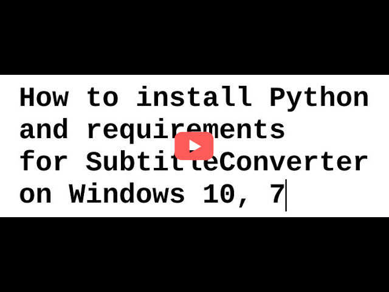

# Subtitle Converter

Program za obradu srt i txt fajlova.

Check out PyQt version: [SubtitleConverter_PyQt](https://github.com/padovaSR/SubtitleConverter_PyQt)

## Requirements:
* [Python](http://www.python.org/) version 3.11 or newer
* [wxPython](https://wxpython.org/) version 4.2.1 or newer
* Libraries: [srt](https://github.com/cdown/srt)
### To install requirements:

Windows: 
```sh
python -m pip install -r /path/to/requirements.txt
```
Linux:
```sh
pip install -r /path/to/requirements.txt
```
### Watch the video:
<p align="left">
  <a href="https://youtu.be/GwLhXvX8xfI" target="_blank"></a>
</p>

## Download Binaries

* [GitHub Releases](https://github.com/padovaSR/subtitle-converter/releases)
* [Last Windows build](https://github.com/padovaSR/subtitle-converter/releases/download/v0.6.2_a1/SubtitleConverter-v0.6.2_a1.zip)
