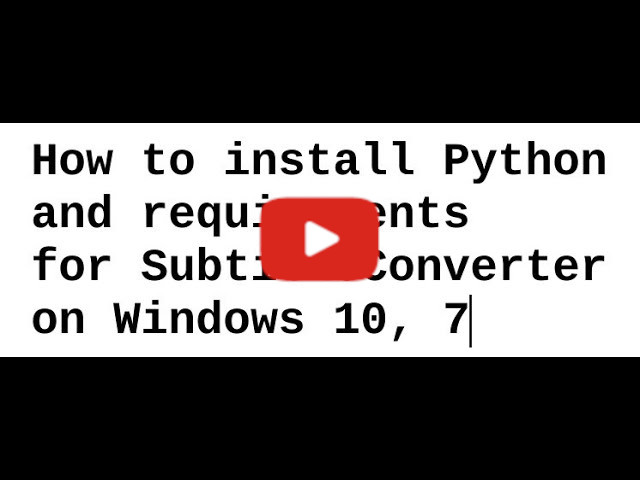

# Subtitle Converter

Program za obradu srt i txt fajlova.

## Requirements:
* [Python](http://www.python.org/) version 3.8
* [wxPython](https://wxpython.org/) version 4.1.0 or newer
* Libraries: [srt](https://github.com/cdown/srt),  [PyDispatcher](https://pypi.org/project/PyDispatcher/)
### To install requirements:

Windows: 
```sh
python -m pip install -r /path/to/requirements.txt
```
Linux:
```sh
pip install -r /path/to/requirements.txt
```
### Watch the video:
<p align="left">
  <a href="https://youtu.be/GwLhXvX8xfI" target="_blank"></a>
</p>

## Download Binaries

* [GitHub Releases](https://github.com/padovaSR/subtitle-converter/releases)
* [Last Windows build](https://github.com/padovaSR/subtitle-converter/releases/download/v0.5.9.0_28/Subtitle.Converter-0.5.9.zip)
